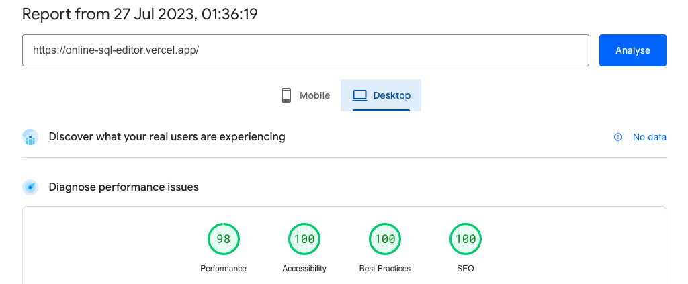

<p align="center">
  <a href="https://github.com/CIPHERTron/sql-editor/">
    
  </a>

  <h2 align="center">SQL Editor [<a href="https://online-sql-editor.vercel.app/">View Live</a>]</h2> 
</p>

<!-- TABLE OF CONTENTS -->
<details open="open">
  <summary>Table of Contents</summary>
  <ol>
  <li>
      <a href="#about-the-project">Key Features</a>
      <ul>
        <li><a href="#demo">Demo Video</a></li>
        <li><a href="#running-the-project">Running the project</a></li>
        <li><a href="#built-with">Built With</a></li>
      </ul>
    </li>
  <li>
      <a href="#getting-started">Getting Started</a>
      <ul>
        <li><a href="#prerequisites">Prerequisites</a></li>
        <li><a href="#running-the-project">Running the project</a></li>
      </ul>
    </li>
  <li>
      <a href="#performance">Performance</a>
  </li>
  <li>
      <a href="#screenshots">Relevant Screenshots</a>
  </li>
  </ol>
</details>

## ℹ️ About The Project

**SQL Editor** aims to provide users with a seamless and user-friendly platform for executing SQL queries, displaying query results with pagination, offering search functionality, maintaining a query history log, and supporting the export of results in CSV or JSON formats. The application will also showcase the execution time of queries and provide a list of available tables in the sidebar for easy reference.

### Key Features:

- **SQL Query Execution**: The application will allow users to input custom SQL queries and execute them against the connected database. Users can run SELECT, INSERT, UPDATE, DELETE, and other SQL commands.

- **Result Display with Pagination**: The application will present query results in a tabular format with smooth pagination. This ensures that large datasets are easily navigable, enhancing the user experience.

- **Search Functionality**: Users will have the ability to search for specific entries within the displayed results. This feature will assist users in finding relevant information quickly and efficiently.

- **Query History**: The application will maintain a history log of all executed queries. Users can revisit previous queries, review results, and re-run them as needed.

- **Export Data**: Users will have the option to download query results in both CSV and JSON formats. This feature enables data sharing and analysis outside the application.

- **Query Execution Time**: Each query execution will be timed, and the application will display the time taken to complete the query. This information helps users gauge query performance and optimize complex queries.

- **List of Available Tables**: The application's sidebar will display a list of available tables in the connected database. Users can easily reference this list when crafting queries, enhancing their workflow efficiency.

### Demo Video

https://github.com/CIPHERTron/sql-editor/assets/56754747/b0b7fda5-878c-4e42-bf13-f76bf0a92a56


### 🛠️ Built With

Following technologies and libraries are used for the development of this
project.

- [React](https://react.dev/)
- [React Ace](https://github.com/securingsincity/react-ace)
- [AlaSQL](http://alasql.org/)
- [Material UI](https://mui.com/)
- [Emotion.js](https://emotion.sh/docs/introduction)
- [ESLint](https://eslint.org/)
- [Prettier](https://prettier.io/)
- [Commitlint](https://commitlint.js.org/#/)

<!-- GETTING STARTED -->

## 📌 Getting Started

To setup the project locally follow the steps below

### Prerequisites

- [Node.js](https://nodejs.org/en/download/)

```sh
# Homebrew
brew install nodejs

# Sudo apt
sudo apt install nodejs

# Packman
pacman -S nodejs

# Module Install
dnf module install nodejs:<stream> # stream is the version

# Windows (chocolaty)
cinst nodejs.install
```

- [Yarn](https://classic.yarnpkg.com/en/docs/install/)

```sh
  npm install --global yarn
```

- [Git](https://git-scm.com/downloads)

```sh
  # Homebrew
  brew install git

  # Sudo apt
  apt-get install git

  # Packman
  pacman -S git

  # Module Install (Fedora)
  dnf install git

```

### 🤖 Running the project.

1. **Fork** and **clone** the project to your local system
2. cd into the project and run

```shell
yarn install
yarn start
```

3. Open _localhost:3000_ to view the application

## Performance

(The forformance of the website was audited using [pagespeed.web.dev](https://pagespeed.web.dev/))

<p align="center">

</p>

### 📉 Relevant Screenshots:

1. _Image showing the SQL editor as well as queries history_
   

2. _Image showing the results table with paginationa, search bar, and export options_
   

3. _Image showing the side bar where all the available tables are listed_
   
